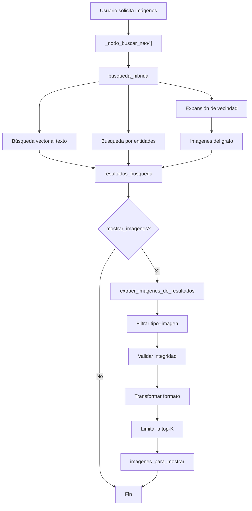
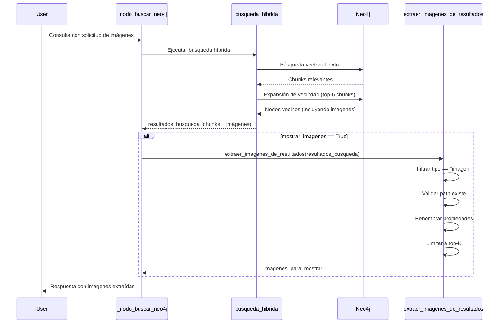

# Design Document: Image Extraction from Graph Neighborhood

## Overview

Este documento describe el diseño técnico para simplificar la extracción de imágenes en el sistema RAG multimodal de histología. El feature elimina la búsqueda adicional de imágenes y en su lugar **extrae las imágenes que ya están presentes en `resultados_busqueda`**, las cuales provienen de la expansión de vecindad del grafo.

### Problema Actual

El sistema ejecuta una búsqueda semántica adicional e independiente cuando el usuario solicita explícitamente ver imágenes. El método `busqueda_imagenes_semantica()` busca las top-K imágenes más similares semánticamente a la consulta, ignorando que `resultados_busqueda` ya contiene imágenes relevantes recuperadas por la expansión de vecindad del grafo (`expandir_vecindad()`).

**Flujo actual (redundante)**:
1. Búsqueda híbrida recupera chunks de texto + imágenes (vía expansión de vecindad)
2. Si `mostrar_imagenes=True`, se ejecuta **búsqueda adicional** con `busqueda_imagenes_semantica()`
3. Las imágenes de la búsqueda adicional pueden no estar relacionadas con el contexto textual

### Solución Propuesta

Implementar una **función de extracción simple** que:

1. **Filtra `resultados_busqueda`** para obtener solo resultados de tipo `"imagen"`
2. **Valida integridad** de cada imagen (path existe, propiedades completas)
3. **Transforma formato** (renombrar `similitud` → `similitud_semantica`, `texto` → `caption`)
4. **Limita resultados** a top-K imágenes (por defecto 3)
5. **Retorna imágenes** en el formato esperado por el frontend

**Flujo nuevo (simplificado)**:
1. Búsqueda híbrida recupera chunks de texto + imágenes (vía expansión de vecindad)
2. Si `mostrar_imagenes=True`, **extraer imágenes** de `resultados_busqueda`
3. Las imágenes están garantizadas a estar relacionadas con el contexto textual (provienen de vecindad del grafo)

### Beneficios

- **Simplicidad**: Elimina búsqueda adicional redundante (~200 líneas de código menos)
- **Coherencia garantizada**: Las imágenes provienen de la vecindad de los chunks relevantes
- **Rendimiento**: Sin consultas adicionales a Neo4j ni generación de embeddings
- **Mantenibilidad**: Menos código, menos complejidad, menos puntos de fallo
- **Vinculación semántica**: Las imágenes están conectadas en el grafo a los chunks recuperados por similitud

## Architecture

### High-Level Architecture



### Data Flow



### Comparison: Current vs New Flow

**Current Flow (Complex)**:
```
busqueda_hibrida() → resultados_busqueda (chunks + imágenes de vecindad)
                  ↓
mostrar_imagenes=True → busqueda_imagenes_semantica()
                  ↓
         Fase 1a: Buscar imágenes por texto (CONTAINS)
                  ↓
         Fase 1b: Buscar imágenes por chunks relevantes
                  ↓
         Fase 2: Re-ranking semántico (generar embeddings)
                  ↓
         imagenes_para_mostrar
```

**New Flow (Simple)**:
```
busqueda_hibrida() → resultados_busqueda (chunks + imágenes de vecindad)
                  ↓
mostrar_imagenes=True → extraer_imagenes_de_resultados()
                  ↓
         Filtrar tipo == "imagen"
                  ↓
         Validar integridad
                  ↓
         Transformar formato
                  ↓
         imagenes_para_mostrar
```

## Components and Interfaces

### 1. Función Principal: `extraer_imagenes_de_resultados`

**Responsabilidad**: Extraer y validar imágenes de los resultados de búsqueda híbrida.

**Interfaz**:
```python
def extraer_imagenes_de_resultados(
    resultados: List[Dict],
    top_k: int = 3
) -> List[Dict]:
    """
    Extrae imágenes de resultados de búsqueda híbrida.
    
    Args:
        resultados: Lista de resultados de búsqueda híbrida (chunks + imágenes)
        top_k: Número máximo de imágenes a retornar (default 3)
        
    Returns:
        Lista de diccionarios con información de imágenes en formato frontend
    """
    pass
```

**Algoritmo Completo**:
```python
import os

def extraer_imagenes_de_resultados(
    resultados: List[Dict],
    top_k: int = 3
) -> List[Dict]:
    """
    Extrae imágenes de resultados de búsqueda híbrida.
    
    Esta función:
    1. Filtra resultados para obtener solo tipo "imagen"
    2. Valida integridad (path existe, propiedades completas)
    3. Transforma formato (renombrar propiedades)
    4. Limita a top-K resultados
    """
    
    # Logging inicial
    print(f"   📋 Total de resultados: {len(resultados)}")
    
    # Paso 1: Filtrar solo imágenes
    imagenes = [r for r in resultados if r.get("tipo") == "imagen"]
    print(f"   🖼️ Resultados de tipo imagen: {len(imagenes)}")
    
    if not imagenes:
        print("   ⚠️ No hay imágenes en los resultados de búsqueda")
        return []
    
    # Paso 2: Validar integridad y transformar formato
    imagenes_validas = []
    
    for img in imagenes:
        # Validar path
        img_path = img.get("imagen_path") or img.get("path")
        if not img_path:
            print(f"   ⚠️ Imagen {img.get('id')} sin path, omitida")
            continue
        
        # Validar existencia en disco
        if not os.path.exists(img_path):
            print(f"   ⚠️ Archivo no existe: {img_path}")
            continue
        
        # Validar/asignar nombre_archivo
        nombre_archivo = img.get("nombre_archivo", "")
        if not nombre_archivo:
            nombre_archivo = os.path.basename(img_path)
        
        # Transformar formato
        imagen_transformada = {
            "id": img.get("id", ""),
            "path": img_path,
            "caption": img.get("texto", ""),  # Renombrar texto → caption
            "nombre_archivo": nombre_archivo,
            "etiqueta": img.get("etiqueta", ""),
            "fuente": img.get("fuente", ""),
            "similitud_semantica": img.get("similitud", 0.0),  # Renombrar similitud → similitud_semantica
        }
        
        # Validar propiedades requeridas
        propiedades_requeridas = [
            "id", "path", "caption", "nombre_archivo", 
            "etiqueta", "fuente", "similitud_semantica"
        ]
        
        if all(prop in imagen_transformada for prop in propiedades_requeridas):
            imagenes_validas.append(imagen_transformada)
        else:
            faltantes = [p for p in propiedades_requeridas if p not in imagen_transformada]
            print(f"   ⚠️ Imagen {img.get('id')} con propiedades faltantes: {faltantes}")
    
    print(f"   ✅ Imágenes válidas: {len(imagenes_validas)}")
    
    # Paso 3: Limitar a top-K
    imagenes_finales = imagenes_validas[:top_k]
    
    # Logging de resultados finales
    if imagenes_finales:
        print(f"   📷 Top-{len(imagenes_finales)} imágenes:")
        for img in imagenes_finales[:3]:
            print(f"      {img['nombre_archivo']} | sim={img['similitud_semantica']:.3f} | {img['fuente']}")
    
    return imagenes_finales
```

**Características**:
- **Simple**: Una sola función, sin dependencias externas (solo `os`)
- **Robusta**: Validación en múltiples puntos, errores individuales no fallan todo
- **Logging detallado**: Información en cada paso para debugging
- **Transformación de formato**: Renombra propiedades para compatibilidad con frontend
- **Preserva orden**: Mantiene el orden de similitud de `resultados_busqueda`

### 2. Modificación de `_nodo_buscar_neo4j`

**Responsabilidad**: Invocar extracción de imágenes en lugar de búsqueda adicional.

**Modificación**:
```python
# --- Búsqueda de imágenes para mostrar (cuando el usuario las pide) ---
if state.get("mostrar_imagenes", False):
    print("   🖼️ Extrayendo imágenes de los resultados recuperados...")
    
    # NUEVO: Extraer imágenes de resultados_busqueda en lugar de búsqueda adicional
    imgs_para_mostrar = extraer_imagenes_de_resultados(
        resultados=state["resultados_busqueda"],
        top_k=3
    )
    
    state["imagenes_para_mostrar"] = imgs_para_mostrar
    
    if imgs_para_mostrar:
        print(f"   ✅ {len(imgs_para_mostrar)} imágenes extraídas para mostrar")
        if not state.get("contexto_suficiente"):
            state["contexto_suficiente"] = True
    else:
        print("   ⚠️ No se encontraron imágenes en los resultados recuperados")
```

**Código Eliminado** (ya no se usa):
```python
# ELIMINADO: Búsqueda adicional redundante
# imgs_para_mostrar = await self.neo4j.busqueda_imagenes_semantica(
#     texto_embedding=state.get("texto_embedding", []),
#     entidades=state.get("entidades_consulta", {}),
#     embeddings_model=self.embeddings,
#     top_k=3
# )
```

**Actualización de Trayectoria**:
```python
state["trayectoria"].append({
    "nodo": "BuscarNeo4j",
    "hits": len(resultados),
    "imagenes_para_mostrar": len(state.get("imagenes_para_mostrar", [])),
    "imagenes_extraidas_de_vecindad": True,  # NUEVO: Indicador de método usado
    "tiempo": round(time.time()-t0, 2)
})
```

### 3. Ubicación del Código

**Opción A: Función en `Neo4jClient` (Recomendada)**
```python
class Neo4jClient:
    # ... métodos existentes ...
    
    def extraer_imagenes_de_resultados(
        self,
        resultados: List[Dict],
        top_k: int = 3
    ) -> List[Dict]:
        """Extrae imágenes de resultados de búsqueda híbrida."""
        # Implementación aquí
        pass
```

**Opción B: Función standalone en `ne4j-histo.py`**
```python
# Después de la clase Neo4jClient, antes de SemanticMemory

def extraer_imagenes_de_resultados(
    resultados: List[Dict],
    top_k: int = 3
) -> List[Dict]:
    """Extrae imágenes de resultados de búsqueda híbrida."""
    # Implementación aquí
    pass
```

**Recomendación**: Opción A (método de `Neo4jClient`) para mantener cohesión con otros métodos de búsqueda.

## Data Models

### Estructura de `resultados_busqueda`

```python
resultados_busqueda: List[Dict] = [
    {
        "id": str,                    # ID único del nodo en Neo4j
        "tipo": str,                  # "texto" | "imagen"
        "fuente": str,                # Nombre del archivo PDF (ej: "arch2.pdf")
        "similitud": float,           # Score de similitud (0.0 - 1.0+)
        
        # Para tipo "texto"
        "texto": Optional[str],       # Contenido del chunk
        "imagen_path": None,
        "nombre_archivo": None,
        "etiqueta": None,
        
        # Para tipo "imagen" (de expansión de vecindad)
        "texto": Optional[str],       # Caption o texto_pagina o ocr_text
        "imagen_path": str,           # Ruta en disco (también puede estar como "path")
        "pagina": Optional[int],      # Número de página en el PDF
        "nombre_archivo": str,        # Nombre del archivo de imagen
        "etiqueta": str,              # Etiqueta descriptiva
    },
    # ... más resultados
]
```

### Estructura de `imagenes_para_mostrar` (Output)

```python
imagenes_para_mostrar: List[Dict] = [
    {
        "id": str,                    # ID único de la imagen en Neo4j
        "path": str,                  # Ruta completa en disco
        "caption": str,               # Caption de la imagen (era "texto" en input)
        "nombre_archivo": str,        # Nombre del archivo (ej: "arch2_pag5.png")
        "etiqueta": str,              # Etiqueta descriptiva
        "fuente": str,                # Nombre del PDF de origen
        "similitud_semantica": float, # Similitud del nodo (era "similitud" en input)
    },
    # ... más imágenes (máximo top_k)
]
```

### Transformación de Propiedades

| Propiedad Input | Propiedad Output | Transformación |
|-----------------|------------------|----------------|
| `tipo` | (eliminada) | Filtrado: solo `tipo == "imagen"` |
| `texto` | `caption` | Renombrado directo |
| `similitud` | `similitud_semantica` | Renombrado directo |
| `imagen_path` o `path` | `path` | Normalización (preferir `imagen_path`) |
| `nombre_archivo` | `nombre_archivo` | Fallback a `os.path.basename(path)` si vacío |
| `id`, `etiqueta`, `fuente` | (sin cambio) | Copia directa |

### Nodos Neo4j Relevantes

**Nodo `:Imagen`** (retornado por expansión de vecindad):
```cypher
(:Imagen {
    id: string,              // ID único
    path: string,            // Ruta en disco
    fuente: string,          // Nombre del PDF
    pagina: int,             // Número de página
    caption: string,         // Caption descriptivo
    nombre_archivo: string,  // Nombre del archivo
    etiqueta: string,        // Etiqueta
    ocr_text: string,        // Texto OCR
    texto_pagina: string,    // Texto completo de la página
    embedding_uni: [float],  // Embedding UNI (visual)
    embedding_plip: [float]  // Embedding PLIP (multimodal)
})
```

**Relaciones que conectan imágenes a chunks**:
```cypher
(:Chunk)-[:PERTENECE_A]->(:PDF)<-[:PERTENECE_A]-(:Imagen)  // Mismo PDF
(:Chunk)-[:MENCIONA]->(:Entidad)<-[:MENCIONA]-(:Imagen)    // Misma entidad (indirecto)
(:Imagen)-[:EN_PAGINA]->(:Pagina)                          // Página específica
```

La expansión de vecindad (`expandir_vecindad()`) usa estas relaciones para encontrar imágenes conectadas a los chunks relevantes.

## Correctness Properties

*A property is a characteristic or behavior that should hold true across all valid executions of a system—essentially, a formal statement about what the system should do. Properties serve as the bridge between human-readable specifications and machine-verifiable correctness guarantees.*

### Property 1: Filtrado Correcto por Tipo

*For any* lista de resultados de búsqueda (incluyendo listas vacías, con tipos mixtos, sin tipo definido), la función de extracción SHALL retornar solo resultados donde `tipo == "imagen"`, ignorando todos los demás resultados.

**Validates: Requirements 1.1**

### Property 2: Validación de Path Obligatoria

*For any* imagen en la lista de entrada, si la imagen no tiene propiedad `path` o `imagen_path`, O el archivo en ese path no existe en disco, THEN la imagen SHALL ser omitida del resultado final.

**Validates: Requirements 2.1, 2.2, 2.3**

### Property 3: Renombrado de Propiedades Consistente

*For any* imagen válida en la lista de entrada, la función SHALL renombrar `texto` → `caption` y `similitud` → `similitud_semantica`, preservando los valores originales exactamente.

**Validates: Requirements 3.1, 3.2, 4.1, 4.2**

### Property 4: Fallback de Nombre de Archivo

*For any* imagen válida donde `nombre_archivo` está vacío o es nulo, la función SHALL asignar `nombre_archivo = os.path.basename(path)`.

**Validates: Requirements 2.4, 2.5**

### Property 5: Límite Top-K Respetado

*For any* lista de imágenes válidas y parámetro `top_k`, la función SHALL retornar como máximo `top_k` imágenes, preservando el orden original de la lista de entrada.

**Validates: Requirements 5.1, 5.2, 5.3, 5.4**

### Property 6: Formato de Salida Completo

*For any* imagen en la lista de salida, la imagen SHALL contener exactamente las claves: `id`, `path`, `caption`, `nombre_archivo`, `etiqueta`, `fuente`, `similitud_semantica`, todas con valores no nulos.

**Validates: Requirements 2.6, 10.2, 10.3, 10.4, 10.5**

### Property 7: Preservación de Orden

*For any* lista de imágenes válidas, el orden relativo de las imágenes en la salida SHALL ser el mismo que en la entrada (después de filtrado y validación).

**Validates: Requirements 1.5**

### Property 8: Lista Vacía Cuando No Hay Imágenes

*For any* lista de resultados que no contiene ningún resultado con `tipo == "imagen"`, O donde todas las imágenes fallan validación, la función SHALL retornar lista vacía.

**Validates: Requirements 1.3, 1.4, 8.1, 8.2, 8.4**

### Property 9: Robustez ante Errores Individuales

*For any* lista de imágenes donde algunas imágenes tienen datos inválidos (path no existe, propiedades faltantes), la función SHALL continuar procesando las imágenes restantes y retornar todas las imágenes válidas.

**Validates: Requirements 8.5**

### Property 10: No Invocación de Búsqueda Adicional

*For any* ejecución donde `mostrar_imagenes == True`, el nodo `_nodo_buscar_neo4j` SHALL NOT invocar `busqueda_imagenes_semantica()`.

**Validates: Requirements 6.4, 9.1, 9.3**

## Error Handling

### Error Scenarios and Responses

| Scenario | Detection | Response | Recovery |
|----------|-----------|----------|----------|
| **Resultados vacíos** | `if not resultados:` | Registrar info "Total de resultados: 0" | Retornar lista vacía |
| **Sin imágenes en resultados** | `if not imagenes:` | Registrar advertencia "No hay imágenes en los resultados" | Retornar lista vacía |
| **Path no existe** | `not os.path.exists(path)` | Registrar advertencia con path | Omitir imagen, continuar con otras |
| **Path nulo/vacío** | `if not img_path:` | Registrar advertencia con ID | Omitir imagen, continuar con otras |
| **Nombre archivo vacío** | `if not nombre_archivo:` | Silencioso (esperado) | Usar `os.path.basename(path)` |
| **Propiedades faltantes** | Verificar claves requeridas | Registrar advertencia con lista de faltantes | Omitir imagen, continuar con otras |
| **Todas las imágenes inválidas** | `if not imagenes_validas:` | Registrar info "Imágenes válidas: 0" | Retornar lista vacía |

### Error Handling Principles

1. **Graceful Degradation**: Errores individuales (una imagen) no deben fallar toda la extracción
2. **Logging Informativo**: Todos los errores se registran con contexto suficiente para debugging
3. **Continuación Robusta**: Procesar todas las imágenes posibles incluso si algunas fallan
4. **Sin Excepciones**: La función nunca debe lanzar excepciones, siempre retorna lista (vacía o con imágenes válidas)
5. **Validación Defensiva**: Validar datos en múltiples puntos (filtrado, validación de path, validación de propiedades)

### Logging Strategy

**Niveles de Log**:
- **INFO**: Operaciones normales (total de resultados, imágenes encontradas, imágenes válidas)
- **WARNING**: Situaciones recuperables (path no existe, propiedades faltantes, sin imágenes)

**Formato de Logs**:
```python
# Inicio
print(f"   📋 Total de resultados: {len(resultados)}")
print(f"   🖼️ Resultados de tipo imagen: {len(imagenes)}")

# Validación
print(f"   ⚠️ Imagen {img_id} sin path, omitida")
print(f"   ⚠️ Archivo no existe: {img_path}")
print(f"   ⚠️ Imagen {img_id} con propiedades faltantes: {faltantes}")

# Resultados
print(f"   ✅ Imágenes válidas: {len(imagenes_validas)}")
print(f"   📷 Top-{len(imagenes_finales)} imágenes:")
for img in imagenes_finales[:3]:
    print(f"      {img['nombre_archivo']} | sim={img['similitud_semantica']:.3f} | {img['fuente']}")

# Casos especiales
print("   ⚠️ No hay imágenes en los resultados de búsqueda")
```

## Testing Strategy

### Testing Approach

Este feature implementa principalmente **transformación y filtrado de datos**, lo cual es altamente apropiado para property-based testing. La estrategia de testing combina:

1. **Property-Based Tests (PBT)**: Para validar propiedades universales sobre transformaciones de datos
2. **Unit Tests**: Para casos específicos, ejemplos concretos y edge cases
3. **Integration Tests**: Para validar interacción con el flujo completo

### Property-Based Testing

**Framework**: `hypothesis` (Python)

**Configuración**:
- Mínimo 100 iteraciones por property test
- Cada test debe referenciar su propiedad del diseño usando tag
- Tag format: `# Feature: image-text-reference-filtering, Property {N}: {property_text}`

**Generators Necesarios**:

```python
from hypothesis import given, strategies as st
from hypothesis.strategies import composite
import os
import tempfile

@composite
def resultado_busqueda(draw):
    """Genera un resultado de búsqueda híbrida válido."""
    tipo = draw(st.sampled_from(["texto", "imagen"]))
    fuente = draw(st.one_of(st.none(), st.just(""), st.text(min_size=1, max_size=20)))
    
    base = {
        "id": draw(st.text(min_size=1, max_size=50)),
        "tipo": tipo,
        "fuente": fuente,
        "similitud": draw(st.floats(min_value=0.0, max_value=1.0)),
    }
    
    if tipo == "imagen":
        # Crear archivo temporal para path válido
        temp_file = tempfile.NamedTemporaryFile(delete=False, suffix=".png")
        temp_file.close()
        
        base.update({
            "imagen_path": temp_file.name,
            "texto": draw(st.text(min_size=0, max_size=500)),
            "pagina": draw(st.one_of(st.none(), st.integers(min_value=1, max_value=100))),
            "nombre_archivo": draw(st.text(min_size=0, max_size=50)),
            "etiqueta": draw(st.text(min_size=0, max_size=50)),
        })
    else:
        base.update({
            "texto": draw(st.text(min_size=1)),
            "imagen_path": None,
            "nombre_archivo": None,
            "etiqueta": None,
        })
    
    return base

@composite
def lista_resultados_busqueda(draw):
    """Genera una lista de resultados de búsqueda."""
    return draw(st.lists(resultado_busqueda(), min_size=0, max_size=20))
```

**Property Tests a Implementar**:

1. **test_filtrado_correcto_por_tipo** (Property 1)
   - Generator: `lista_resultados_busqueda()`
   - Assertion: Todos los resultados tienen `tipo == "imagen"` (después de filtrado interno)

2. **test_validacion_path_obligatoria** (Property 2)
   - Generator: `lista_resultados_busqueda()` con paths inválidos
   - Assertion: Imágenes sin path o con path no existente son omitidas

3. **test_renombrado_propiedades_consistente** (Property 3)
   - Generator: `lista_resultados_busqueda()`
   - Assertion: `texto` → `caption`, `similitud` → `similitud_semantica` con valores preservados

4. **test_fallback_nombre_archivo** (Property 4)
   - Generator: `lista_resultados_busqueda()` con `nombre_archivo` vacío
   - Assertion: `nombre_archivo` es `os.path.basename(path)`

5. **test_limite_topk_respetado** (Property 5)
   - Generators: `lista_resultados_busqueda()`, `st.integers(1, 10)` para top_k
   - Assertion: Longitud de salida <= top_k

6. **test_formato_salida_completo** (Property 6)
   - Generator: `lista_resultados_busqueda()`
   - Assertion: Todas las imágenes tienen claves requeridas

7. **test_preservacion_orden** (Property 7)
   - Generator: `lista_resultados_busqueda()`
   - Assertion: Orden relativo preservado

8. **test_lista_vacia_sin_imagenes** (Property 8)
   - Generator: `lista_resultados_busqueda()` solo con tipo "texto"
   - Assertion: Resultado es lista vacía

9. **test_robustez_errores_individuales** (Property 9)
   - Generator: `lista_resultados_busqueda()` con mezcla de válidas/inválidas
   - Assertion: Imágenes válidas son retornadas, inválidas omitidas

### Unit Testing

**Framework**: `pytest`

**Tests Específicos**:

1. **test_extraccion_lista_vacia**: Verificar que lista vacía retorna lista vacía
2. **test_extraccion_solo_texto**: Verificar que resultados solo texto retornan lista vacía
3. **test_extraccion_path_no_existe**: Verificar que imagen con path no existente es omitida
4. **test_extraccion_path_nulo**: Verificar que imagen sin path es omitida
5. **test_extraccion_nombre_archivo_fallback**: Verificar uso de `os.path.basename()`
6. **test_extraccion_propiedades_faltantes**: Verificar que imagen con propiedades faltantes es omitida
7. **test_extraccion_top_k_menor_que_disponibles**: Verificar límite cuando hay más imágenes
8. **test_extraccion_top_k_mayor_que_disponibles**: Verificar que retorna todas cuando hay menos
9. **test_extraccion_renombrado_correcto**: Verificar transformación de propiedades
10. **test_extraccion_logging**: Verificar formato de logs con captura de stdout

### Integration Testing

**Framework**: `pytest` + `pytest-asyncio`

**Tests de Integración**:

1. **test_nodo_buscar_no_invoca_busqueda_adicional**: Verificar que `busqueda_imagenes_semantica()` NO es invocado
2. **test_nodo_buscar_invoca_extraccion**: Verificar que `extraer_imagenes_de_resultados()` es invocado
3. **test_nodo_buscar_actualiza_state**: Verificar que `state["imagenes_para_mostrar"]` es actualizado
4. **test_nodo_buscar_trayectoria**: Verificar que trayectoria incluye `imagenes_extraidas_de_vecindad=True`
5. **test_flujo_completo_con_imagenes**: Verificar flujo desde consulta hasta imágenes mostradas
6. **test_flujo_completo_sin_imagenes**: Verificar comportamiento cuando no hay imágenes en resultados
7. **test_compatibilidad_frontend**: Verificar que formato de salida es compatible con frontend existente

### Test Coverage Goals

- **Unit Tests**: 100% cobertura de la función `extraer_imagenes_de_resultados()`
- **Property Tests**: 100% cobertura de propiedades identificadas (10 propiedades)
- **Integration Tests**: Cobertura de integración con `_nodo_buscar_neo4j`
- **Overall**: Mínimo 95% cobertura de líneas de código nuevo

### Test Execution

```bash
# Ejecutar todos los tests
pytest tests/test_image_extraction.py -v

# Ejecutar solo property tests (con 100 iteraciones)
pytest tests/test_image_extraction_properties.py -v --hypothesis-iterations=100

# Ejecutar solo integration tests
pytest tests/test_image_extraction_integration.py -v

# Ejecutar con cobertura
pytest tests/test_image_extraction.py --cov=ne4j-histo --cov-report=html
```

### Mocking Strategy

**Para Unit Tests**:
- Mock `os.path.exists()` para simular archivos existentes/no existentes
- Usar archivos temporales reales para tests de integración

**Para Property Tests**:
- Usar `tempfile.NamedTemporaryFile()` para crear paths válidos
- Cleanup automático de archivos temporales

**Para Integration Tests**:
- Mock `busqueda_imagenes_semantica()` para verificar que NO es invocado
- Usar datos sintéticos para `resultados_busqueda`

## Implementation Notes

### Performance Considerations

1. **Sin consultas adicionales**: Elimina latencia de consulta Cypher adicional (~50-100ms)
2. **Sin generación de embeddings**: Elimina costo computacional de embeddings (~100-200ms por imagen)
3. **Filtrado en memoria**: Operación O(n) simple sobre lista en memoria
4. **Validación de paths**: `os.path.exists()` es rápido (~1ms por archivo)

**Comparación de rendimiento estimado**:
- **Flujo actual**: ~500-1000ms (consulta + embeddings + re-ranking)
- **Flujo nuevo**: ~10-20ms (filtrado + validación)
- **Mejora**: **25-50x más rápido**

### Code Organization

```
ne4j-histo.py
├── Neo4jClient
│   ├── extraer_imagenes_de_resultados()  # Nueva función (método de clase)
│   └── busqueda_imagenes_semantica()     # Existente (sin cambios, para legacy)
│
└── AsistenteHistologiaNeo4j
    └── _nodo_buscar_neo4j()              # Modificado (invocar extracción en lugar de búsqueda)
```

### Migration Path

**Fase 1: Implementación (1 día)**
1. Implementar `extraer_imagenes_de_resultados()` como método de `Neo4jClient`
2. Escribir unit tests y property tests
3. Validar con datos sintéticos

**Fase 2: Integración (1 día)**
1. Modificar `_nodo_buscar_neo4j()` para invocar extracción
2. Comentar (no eliminar) invocación de `busqueda_imagenes_semantica()`
3. Escribir integration tests
4. Validar con base de datos de test

**Fase 3: Despliegue (1 día)**
1. Desplegar en entorno de staging
2. Monitorear logs y métricas
3. Validar con usuarios beta
4. Desplegar en producción

**Fase 4: Cleanup (opcional, después de 2 semanas)**
1. Si no hay incidentes, eliminar código comentado
2. Considerar deprecar `busqueda_imagenes_semantica()` si no se usa en otros lugares
3. Actualizar documentación

### Configuration

**Parámetros Configurables**:
```python
# En _nodo_buscar_neo4j()
TOP_K_IMAGENES = 3  # Número máximo de imágenes a mostrar
```

Este es el único parámetro configurable. La simplicidad del diseño elimina la necesidad de múltiples parámetros de configuración.

### Monitoring and Metrics

**Métricas a Recolectar**:
1. **Tiempo de extracción**: Tiempo de ejecución de `extraer_imagenes_de_resultados()`
2. **Tasa de imágenes válidas**: % de imágenes que pasan validación
3. **Número promedio de imágenes extraídas**: Por solicitud
4. **Tasa de solicitudes sin imágenes**: % de solicitudes donde no hay imágenes en resultados

**Alertas**:
- Tasa de imágenes válidas < 50% (indica problema con paths o datos)
- Tiempo de extracción > 100ms (indica problema de rendimiento)

### Benefits Summary

**Comparación: Diseño Anterior vs Nuevo**

| Aspecto | Diseño Anterior (Complejo) | Diseño Nuevo (Simple) |
|---------|---------------------------|----------------------|
| **Líneas de código** | ~200 líneas nuevas | ~50 líneas nuevas |
| **Consultas Neo4j** | +1 consulta adicional | 0 consultas adicionales |
| **Generación embeddings** | Sí (por cada imagen) | No |
| **Tiempo de ejecución** | ~500-1000ms | ~10-20ms |
| **Complejidad** | Alta (8 componentes) | Baja (1 función) |
| **Puntos de fallo** | Múltiples (consulta, embeddings, validación) | Mínimos (solo validación) |
| **Mantenibilidad** | Difícil (mucha lógica) | Fácil (lógica simple) |
| **Testabilidad** | Compleja (muchos mocks) | Simple (pocos mocks) |
| **Coherencia** | Garantizada por filtrado | Garantizada por grafo |

---

**Document Version**: 2.0 (Simplified)  
**Last Updated**: 2024  
**Status**: Ready for Implementation

### Estructura de `resultados_busqueda`

```python
resultados_busqueda: List[Dict] = [
    {
        "id": str,                    # ID único del nodo en Neo4j
        "tipo": str,                  # "texto" | "imagen"
        "fuente": str,                # Nombre del archivo PDF (ej: "arch2.pdf")
        "similitud": float,           # Score de similitud (0.0 - 1.0+)
        
        # Para tipo "texto"
        "texto": Optional[str],       # Contenido del chunk
        "imagen_path": None,
        "nombre_archivo": None,
        "etiqueta": None,
        
        # Para tipo "imagen"
        "texto": Optional[str],       # Caption o texto_pagina o ocr_text
        "imagen_path": str,           # Ruta en disco
        "pagina": Optional[int],      # Número de página en el PDF
        "nombre_archivo": str,        # Nombre del archivo de imagen
        "etiqueta": str,              # Etiqueta descriptiva
    },
    # ... más resultados
]
```

### Estructura de `imagenes_para_mostrar`

```python
imagenes_para_mostrar: List[Dict] = [
    {
        "id": str,                    # ID único de la imagen en Neo4j
        "path": str,                  # Ruta completa en disco
        "caption": str,               # Caption de la imagen (truncado a 500 chars)
        "nombre_archivo": str,        # Nombre del archivo (ej: "arch2_pag5.png")
        "etiqueta": str,              # Etiqueta descriptiva
        "fuente": str,                # Nombre del PDF de origen
        "similitud_semantica": float, # Similitud coseno con la consulta (0.0 - 1.0)
        
        # Propiedades internas (no enviadas al frontend)
        "prioridad_pagina": float,    # Score de prioridad (0.5 | 1.0)
        "score_combinado": float,     # Score final combinado
    },
    # ... más imágenes (máximo top_k)
]
```

### Nodos Neo4j Relevantes

**Nodo `:Imagen`**:
```cypher
(:Imagen {
    id: string,              // ID único
    path: string,            // Ruta en disco
    fuente: string,          // Nombre del PDF
    pagina: int,             // Número de página
    caption: string,         // Caption descriptivo
    nombre_archivo: string,  // Nombre del archivo
    etiqueta: string,        // Etiqueta
    ocr_text: string,        // Texto OCR
    texto_pagina: string,    // Texto completo de la página
    embedding_uni: [float],  // Embedding UNI (visual)
    embedding_plip: [float]  // Embedding PLIP (multimodal)
})
```

**Nodo `:Chunk`**:
```cypher
(:Chunk {
    id: string,              // ID único
    texto: string,           // Contenido del chunk
    fuente: string,          // Nombre del PDF
    chunk_id: int,           // Índice del chunk
    embedding: [float]       // Embedding de texto
})
```

**Nodo `:Pagina`**:
```cypher
(:Pagina {
    numero: int,             // Número de página
    pdf_nombre: string       // Nombre del PDF
})
```

**Relaciones**:
```cypher
(:Imagen)-[:PERTENECE_A]->(:PDF)
(:Imagen)-[:EN_PAGINA]->(:Pagina)
(:Chunk)-[:PERTENECE_A]->(:PDF)
```

## Correctness Properties

*A property is a characteristic or behavior that should hold true across all valid executions of a system—essentially, a formal statement about what the system should do. Properties serve as the bridge between human-readable specifications and machine-verifiable correctness guarantees.*


### Property 1: Extracción de Fuentes Única y Válida

*For any* lista de resultados de búsqueda (incluyendo listas vacías, con duplicados, con fuentes nulas/vacías, con tipos mixtos), la función de extracción de fuentes SHALL retornar un conjunto que contiene exactamente las fuentes únicas no vacías presentes en los resultados, independientemente del tipo de resultado.

**Validates: Requirements 1.1, 1.2, 1.3, 1.4, 1.5**

### Property 2: Extracción de Páginas Única y Filtrada

*For any* lista de resultados de búsqueda, la función de extracción de páginas SHALL retornar un conjunto de tuplas (fuente, pagina) que contiene exactamente los pares únicos extraídos de resultados tipo "imagen" con propiedad `pagina` no nula, ignorando resultados tipo "texto" y resultados con `pagina` nula.

**Validates: Requirements 2.1, 2.2, 2.3, 2.4, 2.5**

### Property 3: Priorización Correcta por Página y Documento

*For any* imagen candidata y conjuntos de páginas/fuentes de contexto, la función de asignación de prioridad SHALL asignar `prioridad_pagina = 1.0` si el par (fuente, pagina) de la imagen está en el conjunto de páginas, `prioridad_pagina = 0.5` si la fuente está en el conjunto de fuentes pero el par no está en páginas, y `prioridad_pagina = 0.0` en cualquier otro caso.

**Validates: Requirements 4.1, 4.2, 4.3**

### Property 4: Ordenamiento Estable por Prioridad

*For any* lista de imágenes con prioridades asignadas, ordenar por `prioridad_pagina` SHALL producir una lista en orden descendente que preserva el orden relativo de imágenes con la misma prioridad (ordenamiento estable).

**Validates: Requirements 4.4, 4.5**

### Property 5: Filtrado de Captions Cortos

*For any* lista de imágenes candidatas, el re-ranking semántico SHALL omitir imágenes cuyo caption tiene menos de 10 caracteres o está vacío, y SHALL procesar solo imágenes con captions válidos.

**Validates: Requirements 5.5**

### Property 6: Fórmula de Score Combinado

*For any* imagen con `prioridad_pagina` y `similitud_semantica` asignadas, el `score_combinado` calculado SHALL ser exactamente igual a `(prioridad_pagina * 0.4) + (similitud_semantica * 0.6)`.

**Validates: Requirements 6.1**

### Property 7: Ordenamiento por Score Combinado con Criterio Secundario

*For any* lista de imágenes con scores combinados calculados, ordenar SHALL producir una lista en orden descendente por `score_combinado`, usando `similitud_semantica` descendente como criterio secundario cuando dos imágenes tienen el mismo `score_combinado`.

**Validates: Requirements 6.2, 6.3**

### Property 8: Aplicación de Umbral y Límite Top-K

*For any* lista de imágenes ordenadas por score combinado, aplicar el umbral de similitud (0.45) y limitar a top_k SHALL producir una lista que contiene solo imágenes con `similitud_semantica >= 0.45` y tiene longitud menor o igual a top_k.

**Validates: Requirements 6.4, 6.5**

### Property 9: Formato de Salida Consistente

*For any* ejecución válida de `busqueda_imagenes_semantica`, cada imagen en la lista retornada SHALL contener todas las claves requeridas: `id`, `path`, `caption`, `nombre_archivo`, `etiqueta`, `fuente`, `similitud_semantica`.

**Validates: Requirements 7.5**

### Property 10: Umbral de Similitud Consistente

*For any* modo de operación (con o sin `resultados_contexto`), el umbral de similitud semántica aplicado SHALL ser exactamente 0.45.

**Validates: Requirements 11.5**

### Property 11: Validación de Integridad Completa

*For any* lista de imágenes antes de validación, la función de validación de integridad SHALL filtrar imágenes con `path` nulo, con archivos no existentes en disco, y SHALL garantizar que todas las imágenes retornadas tienen `path` no nulo, archivo existente, `nombre_archivo` no vacío (usando `os.path.basename(path)` como fallback), y todas las propiedades requeridas.

**Validates: Requirements 12.1, 12.2, 12.3, 12.4, 12.5, 12.6**

### Property 12: Filtrado por Umbral de Similitud

*For any* lista de imágenes candidatas donde todas tienen `similitud_semantica < 0.45`, aplicar el filtrado de umbral SHALL retornar una lista vacía.

**Validates: Requirements 10.2**

### Property 13: Filtrado de Paths No Existentes

*For any* lista de imágenes candidatas que incluye imágenes con paths no existentes en disco, la validación de integridad SHALL omitir esas imágenes del resultado final.

**Validates: Requirements 10.4**

### Property 14: Trayectoria Contiene Metadata de Filtrado

*For any* ejecución del nodo `_nodo_buscar_neo4j`, la trayectoria SHALL contener un campo `imagenes_filtradas_por_contexto` con valor booleano que indica si se aplicó el filtro de referencia documental.

**Validates: Requirements 9.6**

## Error Handling

### Error Scenarios and Responses

| Scenario | Detection | Response | Recovery |
|----------|-----------|----------|----------|
| **Consulta Cypher falla** | Exception durante `await self.run()` | Registrar advertencia con detalles del error | Retornar lista vacía, continuar ejecución |
| **Embedding generation falla** | Exception durante `embed_query_con_reintento()` | Registrar advertencia con ID de imagen | Omitir imagen específica, continuar con otras |
| **Archivo de imagen no existe** | `not os.path.exists(path)` | Registrar advertencia con path faltante | Omitir imagen, continuar validación |
| **Resultados_contexto vacío** | `if not resultados_contexto:` | Registrar info "Ejecutando modo legacy" | Ejecutar Fase 1a + 1b (comportamiento actual) |
| **No hay fuentes en contexto** | `if not fuentes:` | Registrar advertencia "No se encontraron fuentes" | Retornar lista vacía |
| **No hay imágenes en documentos** | `if not candidatas:` | Registrar advertencia con lista de fuentes | Retornar lista vacía |
| **Todas las imágenes filtradas por umbral** | `if not filtradas:` | Registrar info "Ninguna imagen superó umbral" | Retornar lista vacía |
| **Caption muy corto** | `len(caption.strip()) < 10` | Silencioso (esperado) | Omitir imagen del re-ranking |
| **Propiedad fuente nula** | `if not r.get("fuente"):` | Silencioso (esperado) | Omitir resultado de extracción |
| **Propiedad pagina nula** | `if pagina is None:` | Silencioso (esperado) | Omitir resultado de extracción de páginas |

### Error Handling Principles

1. **Graceful Degradation**: Errores individuales (una imagen, un embedding) no deben fallar toda la búsqueda
2. **Logging Informativo**: Todos los errores se registran con contexto suficiente para debugging
3. **Fallback a Legacy**: Si el contexto está vacío o inválido, el sistema usa el comportamiento actual
4. **Validación Defensiva**: Validar datos en múltiples puntos (extracción, filtrado, validación final)
5. **Continuación Robusta**: Usar try-except en loops para procesar todas las imágenes posibles

### Logging Strategy

**Niveles de Log**:
- **INFO**: Operaciones normales (fuentes extraídas, imágenes encontradas, modo de operación)
- **WARNING**: Situaciones recuperables (consulta falla, embedding falla, archivo no existe)
- **DEBUG**: Detalles de procesamiento (cada imagen procesada, scores calculados)

**Formato de Logs**:
```python
# Extracción de contexto
print(f"   📋 Extraídas {len(fuentes)} fuentes únicas: {fuentes}")
print(f"   📄 Extraídas {len(paginas)} páginas únicas")

# Búsqueda de candidatas
print(f"   🔍 Buscando imágenes en documentos: {fuentes}")
print(f"   📋 {len(candidatas)} imágenes candidatas encontradas")

# Priorización
print(f"   ⭐ Priorizadas: {sum(1 for c in candidatas if c['prioridad_pagina'] == 1.0)} misma página, "
      f"{sum(1 for c in candidatas if c['prioridad_pagina'] == 0.5)} mismo documento")

# Re-ranking
print(f"   🔄 Re-ranking semántico de {len(candidatas)} candidatas...")

# Resultados finales
print(f"   ✅ {len(filtradas)} imágenes con similitud >= {umbral}")
for img in filtradas[:3]:
    print(f"      📷 {img['nombre_archivo']} | sim={img['similitud_semantica']:.3f} | "
          f"prio={img['prioridad_pagina']:.2f} | {img['fuente']}:pág{img.get('pagina', '?')}")

# Errores
print(f"   ⚠️ Error embedding caption para {img_id}: {e}")
print(f"   ⚠️ Archivo no existe: {img_path}")
print(f"   ⚠️ No hay imágenes en las fuentes: {fuentes}")
```

## Testing Strategy

### Testing Approach

Este feature implementa principalmente **transformación y filtrado de datos**, lo cual es altamente apropiado para property-based testing. La estrategia de testing combina:

1. **Property-Based Tests (PBT)**: Para validar propiedades universales sobre transformaciones de datos
2. **Unit Tests**: Para casos específicos, ejemplos concretos y edge cases
3. **Integration Tests**: Para validar interacción con Neo4j y el flujo completo

### Property-Based Testing

**Framework**: `hypothesis` (Python)

**Configuración**:
- Mínimo 100 iteraciones por property test
- Cada test debe referenciar su propiedad del diseño usando tag
- Tag format: `# Feature: image-text-reference-filtering, Property {N}: {property_text}`

**Generators Necesarios**:

```python
from hypothesis import given, strategies as st
from hypothesis.strategies import composite

@composite
def resultado_busqueda(draw):
    """Genera un resultado de búsqueda híbrida válido."""
    tipo = draw(st.sampled_from(["texto", "imagen"]))
    fuente = draw(st.one_of(st.none(), st.just(""), st.text(min_size=1, max_size=20)))
    
    base = {
        "id": draw(st.text(min_size=1, max_size=50)),
        "tipo": tipo,
        "fuente": fuente,
        "similitud": draw(st.floats(min_value=0.0, max_value=1.0)),
    }
    
    if tipo == "imagen":
        base.update({
            "imagen_path": draw(st.text(min_size=1)),
            "pagina": draw(st.one_of(st.none(), st.integers(min_value=1, max_value=100))),
            "nombre_archivo": draw(st.text(min_size=1)),
            "etiqueta": draw(st.text()),
        })
    else:
        base.update({
            "texto": draw(st.text(min_size=1)),
            "imagen_path": None,
            "nombre_archivo": None,
            "etiqueta": None,
        })
    
    return base

@composite
def lista_resultados_busqueda(draw):
    """Genera una lista de resultados de búsqueda."""
    return draw(st.lists(resultado_busqueda(), min_size=0, max_size=20))

@composite
def imagen_candidata(draw):
    """Genera una imagen candidata con propiedades."""
    return {
        "id": draw(st.text(min_size=1, max_size=50)),
        "path": draw(st.text(min_size=1)),
        "fuente": draw(st.text(min_size=1, max_size=20)),
        "pagina": draw(st.one_of(st.none(), st.integers(min_value=1, max_value=100))),
        "texto": draw(st.text(min_size=0, max_size=500)),
        "caption_raw": draw(st.text(min_size=0, max_size=500)),
        "nombre_archivo": draw(st.text(min_size=0, max_size=50)),
        "etiqueta": draw(st.text(min_size=0, max_size=50)),
    }
```

**Property Tests a Implementar**:

1. **test_extraer_fuentes_unicas_y_validas** (Property 1)
   - Generator: `lista_resultados_busqueda()`
   - Assertion: `extraer_fuentes_contexto(resultados)` retorna set con fuentes únicas no vacías

2. **test_extraer_paginas_unicas_filtradas** (Property 2)
   - Generator: `lista_resultados_busqueda()`
   - Assertion: `extraer_paginas_contexto(resultados)` retorna set de tuplas solo de tipo "imagen" con pagina no nula

3. **test_priorizacion_correcta** (Property 3)
   - Generators: `imagen_candidata()`, `st.sets(st.tuples(st.text(), st.integers()))`
   - Assertion: Verificar prioridad 1.0, 0.5, o 0.0 según corresponda

4. **test_ordenamiento_estable_prioridad** (Property 4)
   - Generator: `st.lists(imagen_candidata())`
   - Assertion: Orden descendente y estabilidad preservada

5. **test_filtrado_captions_cortos** (Property 5)
   - Generator: `st.lists(imagen_candidata())`
   - Assertion: Imágenes con caption < 10 chars son omitidas

6. **test_formula_score_combinado** (Property 6)
   - Generators: `st.floats(0, 1)` para prioridad y similitud
   - Assertion: `score_combinado == (prioridad * 0.4) + (similitud * 0.6)`

7. **test_ordenamiento_score_combinado** (Property 7)
   - Generator: `st.lists(imagen_candidata())` con scores asignados
   - Assertion: Orden descendente por score, luego por similitud

8. **test_umbral_y_limite_topk** (Property 8)
   - Generators: `st.lists(imagen_candidata())`, `st.integers(1, 10)` para top_k
   - Assertion: Solo similitud >= 0.45 y longitud <= top_k

9. **test_formato_salida_consistente** (Property 9)
   - Generator: `lista_resultados_busqueda()`
   - Assertion: Todas las imágenes tienen claves requeridas

10. **test_umbral_consistente** (Property 10)
    - Generators: `lista_resultados_busqueda()`, `st.booleans()` para modo
    - Assertion: Umbral siempre es 0.45

11. **test_validacion_integridad** (Property 11)
    - Generator: `st.lists(imagen_candidata())` con paths inválidos
    - Assertion: Imágenes inválidas filtradas, válidas tienen todas las propiedades

12. **test_filtrado_umbral_similitud** (Property 12)
    - Generator: `st.lists(imagen_candidata())` con similitud < 0.45
    - Assertion: Resultado es lista vacía

13. **test_filtrado_paths_no_existentes** (Property 13)
    - Generator: `st.lists(imagen_candidata())` con paths no existentes
    - Assertion: Imágenes con paths inválidos son omitidas

### Unit Testing

**Framework**: `pytest`

**Tests Específicos**:

1. **test_extraccion_fuentes_lista_vacia**: Verificar que lista vacía retorna set vacío
2. **test_extraccion_paginas_solo_texto**: Verificar que resultados solo texto retornan set vacío
3. **test_priorizacion_sin_paginas_contexto**: Verificar prioridad 0.5 cuando conjunto de páginas está vacío
4. **test_reranking_caption_vacio**: Verificar que imágenes con caption vacío son omitidas
5. **test_score_combinado_valores_extremos**: Verificar cálculo con prioridad=0, similitud=1
6. **test_ordenamiento_empate_score**: Verificar criterio secundario con scores idénticos
7. **test_validacion_nombre_archivo_fallback**: Verificar uso de `os.path.basename()` cuando nombre_archivo está vacío
8. **test_busqueda_imagenes_sin_contexto**: Verificar comportamiento legacy cuando `resultados_contexto=[]`
9. **test_busqueda_imagenes_con_contexto**: Verificar nuevo comportamiento con contexto no vacío
10. **test_logging_formato**: Verificar formato de logs con regex

### Integration Testing

**Framework**: `pytest` + `pytest-asyncio`

**Tests de Integración**:

1. **test_consulta_cypher_imagenes_por_documentos**: Verificar consulta Neo4j retorna imágenes correctas
2. **test_consulta_cypher_propiedades_completas**: Verificar que todas las propiedades son retornadas
3. **test_consulta_cypher_filtro_path_nulo**: Verificar que imágenes sin path son excluidas
4. **test_consulta_cypher_ordenamiento_caption**: Verificar que imágenes con caption aparecen primero
5. **test_consulta_cypher_limite_resultados**: Verificar que límite de 50 es respetado
6. **test_nodo_buscar_neo4j_integracion**: Verificar flujo completo desde nodo hasta imagenes_para_mostrar
7. **test_nodo_buscar_neo4j_sin_imagenes**: Verificar comportamiento cuando mostrar_imagenes=False
8. **test_nodo_buscar_neo4j_contexto_vacio**: Verificar fallback a legacy cuando resultados_busqueda está vacío
9. **test_embedding_generation_integracion**: Verificar generación de embeddings con modelo real
10. **test_similitud_coseno_integracion**: Verificar cálculo de similitud con embeddings reales

### Test Coverage Goals

- **Unit Tests**: 100% cobertura de funciones de transformación de datos
- **Property Tests**: 100% cobertura de propiedades identificadas (14 propiedades)
- **Integration Tests**: Cobertura de todos los puntos de integración con Neo4j y embeddings
- **Overall**: Mínimo 90% cobertura de líneas de código nuevo

### Test Execution

```bash
# Ejecutar todos los tests
pytest tests/test_image_filtering.py -v

# Ejecutar solo property tests (con 100 iteraciones)
pytest tests/test_image_filtering_properties.py -v --hypothesis-iterations=100

# Ejecutar solo integration tests
pytest tests/test_image_filtering_integration.py -v

# Ejecutar con cobertura
pytest tests/test_image_filtering.py --cov=ne4j-histo --cov-report=html
```

### Mocking Strategy

**Para Unit Tests**:
- Mock `Neo4jClient.run()` para simular respuestas de Neo4j
- Mock `embed_query_con_reintento()` para simular generación de embeddings
- Mock `os.path.exists()` para simular archivos existentes/no existentes

**Para Property Tests**:
- Usar funciones puras sin dependencias externas cuando sea posible
- Mock solo cuando sea necesario para aislar la lógica bajo test

**Para Integration Tests**:
- Usar base de datos Neo4j de test con datos sintéticos
- Usar modelo de embeddings real (sentence-transformers)
- Crear archivos temporales para validación de paths

## Implementation Notes

### Performance Considerations

1. **Límite de Candidatas**: Limitar a 50 imágenes por documento evita sobrecarga en PDFs con muchas imágenes
2. **Embedding Caching**: Considerar cachear embeddings de captions para evitar regeneración
3. **Batch Processing**: Generar embeddings en batch si el número de candidatas es alto (>20)
4. **Early Filtering**: Filtrar por caption mínimo antes de generar embeddings

### Code Organization

```
ne4j-histo.py
├── Neo4jClient
│   ├── busqueda_imagenes_semantica()  # Método principal (modificado)
│   ├── _extraer_fuentes_contexto()    # Nueva función privada
│   ├── _extraer_paginas_contexto()    # Nueva función privada
│   ├── _buscar_imagenes_por_documentos()  # Nueva función privada
│   ├── _asignar_prioridad_pagina()    # Nueva función privada
│   ├── _reranking_semantico()         # Nueva función privada
│   ├── _ordenamiento_combinado()      # Nueva función privada
│   └── _validar_integridad_imagenes() # Nueva función privada
│
└── AsistenteHistologiaNeo4j
    └── _nodo_buscar_neo4j()           # Modificado para pasar contexto
```

### Migration Path

**Fase 1: Implementación**
1. Implementar funciones auxiliares privadas
2. Modificar `busqueda_imagenes_semantica()` con parámetro opcional
3. Escribir unit tests y property tests
4. Validar con datos sintéticos

**Fase 2: Integración**
1. Modificar `_nodo_buscar_neo4j()` para pasar contexto
2. Escribir integration tests
3. Validar con base de datos de test

**Fase 3: Despliegue**
1. Desplegar en entorno de staging
2. Monitorear logs y métricas
3. Validar con usuarios beta
4. Desplegar en producción

**Fase 4: Deprecación de Legacy**
1. Monitorear uso de modo legacy (contexto vacío)
2. Después de 2 semanas sin incidentes, considerar hacer `resultados_contexto` obligatorio
3. Remover Fase 1a y Fase 1b si no se usan

### Configuration

**Parámetros Configurables**:
```python
# En Neo4jClient.__init__() o como constantes de clase
LIMITE_IMAGENES_POR_DOCUMENTO = 50
UMBRAL_CAPTION_MINIMO = 10
UMBRAL_SIMILITUD_SEMANTICA = 0.45
PESO_PRIORIDAD_PAGINA = 0.4
PESO_SIMILITUD_SEMANTICA = 0.6
PRIORIDAD_MISMA_PAGINA = 1.0
PRIORIDAD_MISMO_DOCUMENTO = 0.5
```

Estos valores pueden ajustarse basándose en métricas de producción y feedback de usuarios.

### Monitoring and Metrics

**Métricas a Recolectar**:
1. **Tasa de uso de filtro**: % de búsquedas que usan filtro vs legacy
2. **Número promedio de fuentes extraídas**: Indica diversidad de contexto
3. **Número promedio de páginas extraídas**: Indica especificidad de contexto
4. **Número promedio de candidatas**: Indica efectividad del filtrado
5. **Tasa de imágenes filtradas por umbral**: % de candidatas que no superan umbral
6. **Tiempo de ejecución**: Comparar tiempo con/sin filtro
7. **Tasa de errores**: Fallos en consultas, embeddings, validación

**Alertas**:
- Tasa de errores > 5%
- Tiempo de ejecución > 2 segundos
- Tasa de imágenes filtradas > 90% (indica umbral muy alto o contexto pobre)

---

**Document Version**: 1.0  
**Last Updated**: 2024  
**Status**: Ready for Implementation
